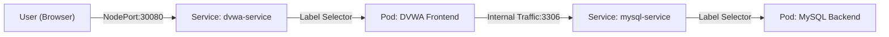
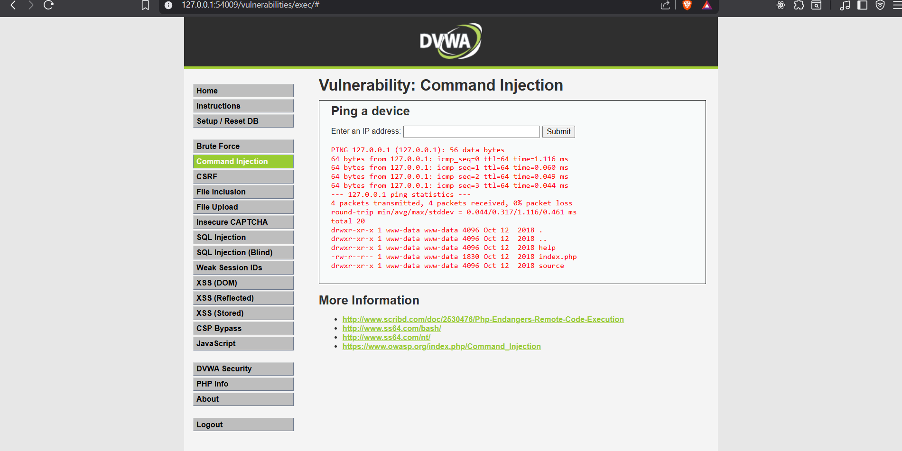
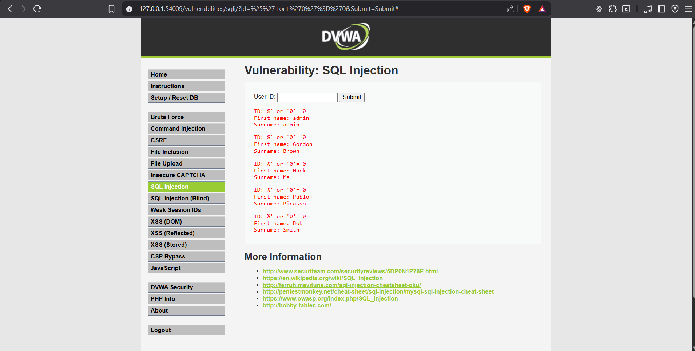
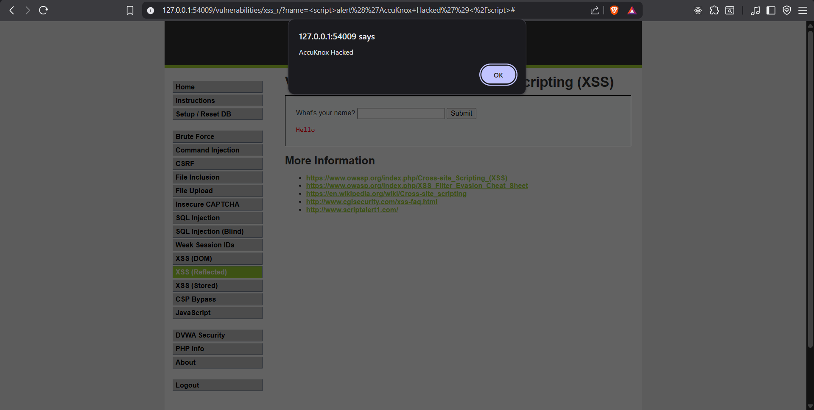

# AccuKnox Solution Engineer Assignment - Secure K8s Deployment

This repository contains a secure, automated Kubernetes deployment of the Damn Vulnerable Web Application (DVWA) with a MySQL backend. It demonstrates Infrastructure-as-Code best practices, secrets management, and reproduced vulnerability assessments.

## 🏗️ Architecture



## 🛠️ Tech Stack
- **Orchestration**: Kubernetes v1.34+ (Minikube)
- **Application**: DVWA (Damn Vulnerable Web App)
- **Database**: MySQL 5.7
- **Automation**: PowerShell Scripting
- **Secret Management**: Kubernetes Secrets (Environment-injected)

## 🚀 Setup Instructions

### Prerequisites
- **Minikube** (Installed & Running)
- **PowerShell**

### Quick Start
We provided an automated deployment script to handle secrets and rollout.

1. **Clone the repository**:
   ```powershell
   git clone <repo-url>
   cd accuknox-sumit-verma
   ```
2. **Deploy**:
   ```powershell
   .\scripts\deploy.ps1
   ```
   *The script will automatically detect if Minikube is off, read your local `.env`, and deploy the stack.*

3. **Access**:
   - The script will output the URL (e.g., `http://127.0.0.1:54009`).
   - Log in with `admin` / `password`.
   - **Important**: Go to "DVWA Security" and set level to **Low**.

## 🔒 Security Implementation
- **Secrets Management**: Database passwords are **never** committed.
  - A `.gitignore` rule strictly blocks `*.secret`, `.env`, and similar patterns.
  - Secrets are injected from a local `.env` file into Kubernetes Secrets at runtime via the deployment script.
- **Network Policies**: Database is exposed only via ClusterIP (internal), not externally.

## 🛡️ Verified Vulnerabilities

We have successfully demonstrated and documented the critical attack vectors on this deployment. See [Attack Demo Guide](docs/attacks.md) for step-by-step reproduction.

### 1. Vulnerability: Command Injection
**Description**: Verified Remote Code Execution (RCE) by chaining shell commands.
- **Payload Used**: `127.0.0.1; ls -la`
- **Impact**: The application failed to sanitize the input, allowing the execution of the `ls` command after the ping. This exposed the internal file system structure of the Kubernetes pod, including sensitive web root directories.



### 2. Vulnerability: SQL Injection (SQLi)
**Description**: Verified SQL Injection authentication bypass and data dump.
- **Payload Used**: `%' or '0'='0`
- **Impact**: The input was treated as part of the SQL query logic rather than data. This manipulated the query to return TRUE for all records, causing the database to leak the entire user table (including First Name and Surname) instead of a single record.



### 3. Vulnerability: Reflected XSS
**Description**: Verified Cross-Site Scripting by executing arbitrary JavaScript.
- **Payload Used**: `<script>alert('AccuKnox Hacked')</script>`
- **Impact**: The application reflected the user input directly back to the browser without escaping HTML characters. This allowed the execution of a custom script, demonstrating how an attacker could hijack user sessions or redirect users.


