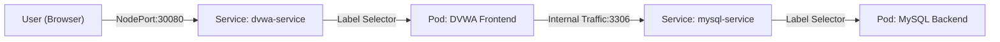

# AccuKnox Solution Engineer Assignment - Secure K8s Deployment

This repository contains a secure, automated Kubernetes deployment of the Damn Vulnerable Web Application (DVWA) with a MySQL backend. It demonstrates Infrastructure-as-Code best practices, secrets management, and reproduced vulnerability assessments.

## 🏗️ Architecture



## 🛠️ Tech Stack
- **Orchestration**: Kubernetes v1.34+ (Minikube)
- **Application**: DVWA (Damn Vulnerable Web App)
- **Database**: MySQL 5.7
- **Automation**: PowerShell Scripting
- **Secret Management**: Kubernetes Secrets (Environment-injected)

## 🚀 Setup Instructions

### Prerequisites
- **Minikube** (Installed & Running)
- **PowerShell**

### Quick Start
We provided an automated deployment script to handle secrets and rollout.

1. **Clone the repository**:
   ```powershell
   git clone <repo-url>
   cd accuknox-sumit-verma
   ```
2. **Deploy**:
   ```powershell
   .\scripts\deploy.ps1
   ```
   *The script will automatically detect if Minikube is off, read your local `.env`, and deploy the stack.*

3. **Access**:
   - The script will output the URL (e.g., `http://127.0.0.1:54009`).
   - Log in with `admin` / `password`.
   - **Important**: Go to "DVWA Security" and set level to **Low**.

## 🔒 Security Implementation
- **Secrets Management**: Database passwords are **never** committed.
  - A `.gitignore` rule strictly blocks `*.secret`, `.env`, and similar patterns.
  - Secrets are injected from a local `.env` file into Kubernetes Secrets at runtime via the deployment script.
- **Network Policies**: Database is exposed only via ClusterIP (internal), not externally.

## 🛡️ Verified Vulnerabilities
We have successfully demonstrated and documented the following attacks on this deployment. See [Attack Demo Guide](docs/attacks.md) for step-by-step reproduction.

1.  **SQL Injection**: Bypassed login authentication to dump user database.
2.  **Reflected XSS**: Executed arbitrary JavaScript contexts in the browser.
3.  **Command Injection**: Achieved remote code execution (RCE) on the container.
